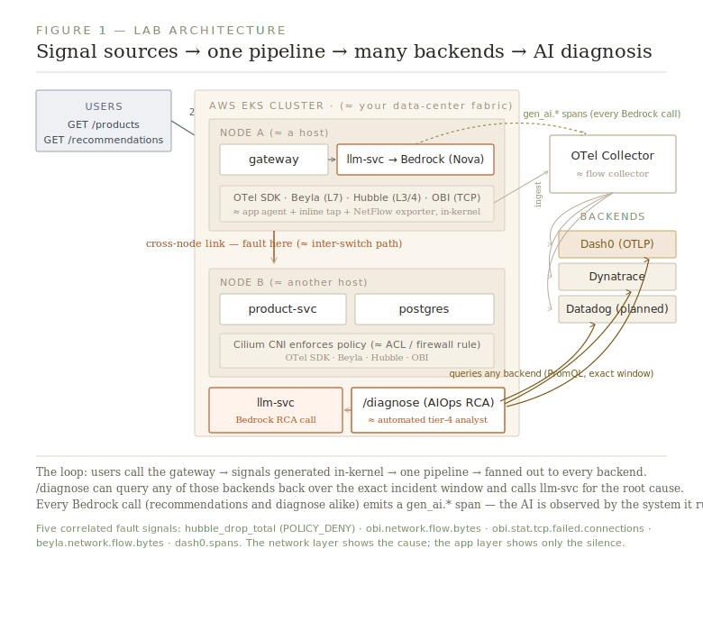
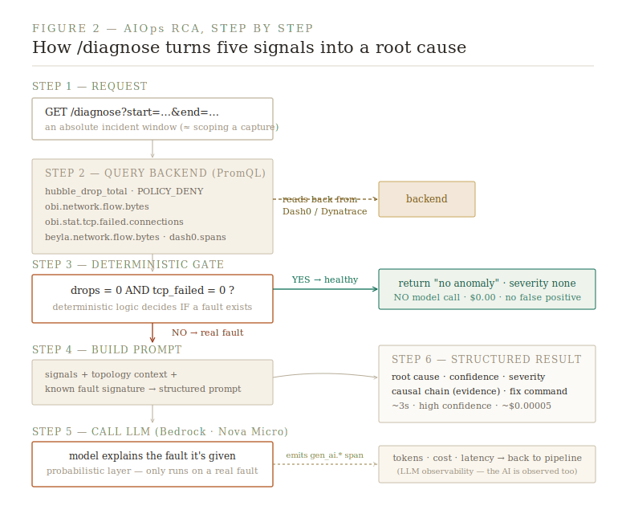
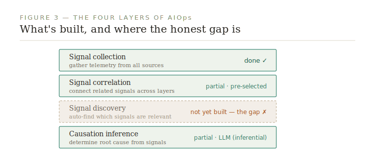

# The OTel Observability Lab — Technical Summary
### For the network-observability practitioner: a cloud-native bridge to the world you already know

*Surit Maharana · github.com/suritmaharana-maker/otel-observability-lab*

---

## Why this exists (in your language)

You already know the hardest problem in observability isn't collection — it's **correlation across the boundary**. On-prem, you live it daily: the app team stares at APM, you stare at flows and packets on Riverbed or NetProfiler, and the two pictures never line up without a human in the middle. The "bridge call" exists because the toolchains were never built to speak to each other.

This lab proves that in cloud-native Kubernetes, that bridge can finally be built — using one open pipeline that carries **both** worlds: application traces *and* network telemetry, correlated automatically, in one place, with one query language. Then it puts an LLM on top to do the correlation a tier-4 analyst would do — in seconds.

Think of it as: **AppResponse + NetProfiler + an APM tool + an automated analyst, reassembled from open-source parts, with no vendor lock-in.**

---

## The architecture, translated to on-prem terms

Three microservices run on a managed Kubernetes (AWS EKS) cluster — a **gateway**, a **product service**, and a **PostgreSQL** database. The gateway sits on one node; the product service on another. That cross-node placement is deliberate, and it's the same instinct you have on-prem: **the interesting failures happen on the path *between* boxes**, not inside one.

Here is the component-by-component translation:

| Cloud-native component | What it does | Your on-prem analogue |
|---|---|---|
| **eBPF** | Captures traffic and events *inside the Linux kernel* — no SPAN port, no inline tap, no agent in the app | A tap/SPAN that's built into the host itself, always on, zero-touch |
| **Cilium (CNI) + Hubble** | The network layer; enforces policy and exports L3/L4 flow + drop metrics | Your switching fabric + NetFlow exporter + ACL/firewall enforcement, combined |
| **Grafana Beyla** | Auto-instruments L7 (HTTP) traffic via eBPF — no code change | An L7-aware tap that produces application-transaction records with zero app cooperation |
| **OBI (OTel eBPF Instrumentation)** | TCP connection stats: failed connections, RTT, flow bytes | The TCP-health view you'd get from packet analysis — retransmits, resets, handshake failures |
| **OpenTelemetry SDK** | In-app instrumentation: distributed traces, spans | Classic APM bytecode instrumentation (think Wily/AppInternals) |
| **OTel Collector** | One pipeline that ingests every signal and routes it onward | A flow collector / visibility broker (cPacket, Arista DMF) — aggregation and fan-out, but for *all* signal types, not just packets |
| **Dash0 / Dynatrace / Datadog** | Interchangeable storage + analysis backends | Riverbed Portal / NetProfiler / your SIEM — except swappable with a one-line change |
| **/diagnose (LLM)** | Reads the correlated signals and names the root cause | An automated tier-4 analyst who already knows the topology |

The key mental shift: on-prem, each signal class needs its own appliance and its own collector. Here, **every signal class — L3/4 flows, L7 transactions, TCP stats, app traces — is generated in-kernel and carried by one pipeline.** No separate tap infrastructure. No SPAN-port contention. No per-tool collector sprawl.

---

## The demonstration: proving the blindspot

The lab's core proof is a controlled fault, exactly the kind you'd reproduce in a lab cert.

**The fault:** a Cilium network policy (≈ an ACL / firewall rule) blocks all TCP traffic from the gateway to the product service on its port. Sixteen lines of configuration; a complete service outage.

**What each layer sees — the whole point:**

- **The application trace (APM view):** a single request that times out after ~5 seconds, returns a 502, and has *no child spans*. The app knows something failed. It has no idea what. This is the lonely timeout you've watched the app team stare at.
- **The network layer (your view):** `hubble_drop_total{reason="POLICY_DENY"}` spikes. Every connection attempt is being denied at the policy layer, and each denial is recorded — the cloud-native equivalent of watching an ACL drop counter climb while the app sees only silence.

Same incident. Two signals. One backend. **No bridge call** — because the correlation that normally requires a human already happened at the collection layer.

When run as a structured 20-minute test with two fault windows, the signal correlation is unambiguous. During each fault:

| Signal | On-prem analogue | Behavior during fault |
|---|---|---|
| `hubble_drop_total` (POLICY_DENY) | ACL/firewall drop counter | **spikes** |
| `obi.network.flow.bytes` | inter-host flow volume | **collapses** |
| `obi.stat.tcp.failed.connections` | TCP handshake failures / resets | **spikes** |
| `beyla.network.flow.bytes` | L7 transaction volume | shows retry traffic |
| `dash0.spans` (product-svc) | APM transaction count | **drops to zero** |

The network layer shows the *cause* (policy enforcement). The app layer shows only the *effect* (silence). That gap — cause visible on one side, effect on the other — is the exact gap you bridge by hand today.

*(One honest finding worth noting for fellow practitioners: a commonly-cited belief that Beyla exposes TCP retransmit counts as a queryable metric does not hold up — verified against the live endpoint. The retransmit tracepoint is used internally only. The lab uses policy drops, flow bytes, and TCP failed connections instead, which carry the same diagnostic weight.)*

---

## LLM Observability — APM, but for the AI model call

As soon as you put an LLM in the path, you inherit a new black box: *how long did the model take, how many tokens did it burn, and what did it cost?* **LLM observability** answers that — and the lab does it the standards-based way, using OpenTelemetry's **`gen_ai.*` semantic conventions** (the emerging industry standard for instrumenting model calls, the same way `http.*` standardized web telemetry years ago).

Every call to the model (AWS Bedrock, Amazon Nova Micro) emits a span carrying: model name, **input/output token counts**, **dollar cost**, latency, and temperature. Crucially, that span sits **in the same distributed trace** as the HTTP request and the database query that triggered it. So one request's waterfall reads: *N ms in the model, M ms calling product-svc, a few ms in Postgres* — with the AI portion's cost attached.

**The on-prem translation:** this is per-transaction APM decomposition — the same breakdown you'd want of a slow trade or a slow query — except one of the tiers is now an AI model, and the metric that matters most is **cost per call**, not just latency. For anyone who's ever had to defend capacity spend, cost-attributed AI telemetry is the part that lands.

Why it matters: most teams bolting GenAI into production have **zero** visibility into model cost and latency at the request level. This is the layer that's missing from most architectures — and here it's just another signal class on the same pipeline (MELT — metrics, events, logs, traces — extended to the model). The AI is observed by the very system it helps run.

---

## AIOps RCA — an automated tier-4 analyst, with guardrails

This is where it goes beyond AppResponse + APM. The lab exposes a `/diagnose` endpoint that performs **automated root-cause analysis (RCA)** — the AIOps pattern — over real, correlated signals.

You hand it an **absolute incident window** (exact start/end, the way you'd scope a packet capture), and it:

1. **Queries** the backend's Prometheus API (PromQL) for the correlated signals over that exact window — drops, flow bytes, TCP failures, app spans. *(Live signals, not aggregates — RED metrics: Rate, Errors, Duration.)*
2. **Assembles** them into a structured prompt with topology context — which service talks to which, what a POLICY_DENY verdict means.
3. **Calls** the LLM for a structured root cause.
4. **Returns** root cause, confidence, the **causal chain** (evidence), a remediation command, severity, model, latency, and cost.

For a real fault it returns — in ~3 seconds, for roughly five-thousandths of a cent:

> **Root cause:** A network policy is blocking traffic between the gateway and product service.
> **Confidence:** high · **Severity:** critical
> **Evidence (causal chain):** policy-deny drops spiked → flow bytes dropped → TCP failures spiked → app spans fell to zero.

**The guardrail that matters.** The first version would confidently diagnose a "critical fault" on a *healthy* system, because the model pattern-matched the prompt — a textbook **LLM false-positive / hallucination**. So the lab adds a **deterministic healthy-path gate**: if the two unambiguous fault fingerprints (policy drops and TCP failures) are both zero, it returns "no anomaly" *without ever calling the model*. **Deterministic logic decides whether a problem exists; the probabilistic model only explains one that does.** That deterministic-gates-probabilistic principle is exactly what the commercial leaders (e.g. Dynatrace's causal AI constraining its generative layer) now build on — arrived at here independently. It's also your own instinct codified: gate on the signals you trust before you escalate.

**Honest maturity — where the automation stops.** AIOps has four layers; naming where you sit is the credibility:

- **Signal collection** — ✓ done.
- **Signal correlation** — ✓ but *pre-selected*: the queries are expert-defined, not auto-discovered.
- **Signal discovery** (auto-finding which series are anomalous without being told) — ✗ not built. The honest frontier.
- **Causation inference** — ✓ partial: the LLM **infers** cause from effects. It reads the drop spike (an effect) and names the policy (the cause) — but it never saw the actual `kubectl apply` change event. Making it **deterministic** rather than inferential means feeding it **change-management data** (the Kubernetes audit log) — the cloud analogue of correlating a config-change timestamp against a drop counter, which Cisco Nexus Dashboard Insights does on-prem. That's the next build.

---

## Full feature inventory

**Signal coverage — full-stack MELT + network (all proven on a live cluster):**
- L3/L4 network flows and policy-deny drops (Cilium/Hubble) — *NetO11y*
- L7 HTTP transactions, auto-instrumented, zero code change (Beyla, eBPF) — RED metrics
- TCP connection stats — failed connections, RTT, flow bytes (OBI) — *StatsO11y*
- Application distributed traces and spans (OpenTelemetry SDK) — *AppO11y*
- LLM call observability — token counts, cost, latency, model — in the same trace (`gen_ai.*` conventions)

**LLM Observability:**
- Standards-based `gen_ai.*` semantic-convention spans on every Bedrock call
- Per-request **cost attribution** (dollars per call) and token accounting
- Model spans correlated in the same trace as HTTP + DB — full request decomposition
- The AI layer is itself observable on the same pipeline it diagnoses

**Pipeline & portability:**
- One OTel Collector ingests and routes every signal class — vendor-neutral by design
- Validated across backends (Dash0 live; Dynatrace via OTLP; Datadog planned) — no re-instrumentation
- Backend swap = a one-line collector exporter change. Nothing else moves. *(Cardinality, not backend choice, drives cost — the lever is at the Collector.)*

**AIOps RCA:**
- `/diagnose` automated root-cause analysis over an **absolute incident window** (exact start/end, not "last N minutes")
- **Deterministic healthy-path gate** — deterministic logic decides *if* a fault exists; the LLM only explains one that does (no hallucinated false positives, zero wasted spend)
- **Causal-chain** reasoning across all five signal layers; high-confidence RCA in ~3s for fractions of a cent
- Honest maturity: collection ✓ · correlation ✓ · discovery ✗ · causation ✓ (partial/inferential)

**Engineering & operations:**
- Infrastructure-as-code: Terraform (cluster, VPC, node group) + Ansible
- Reproducible 20-minute structured fault-injection test (committed script)
- On-demand bring-up / tear-down for cost control (full operational runbook included)
- Runs on production-grade managed Kubernetes (EKS, kernel 6.12, current Cilium/Beyla/OBI/Collector versions)

**Honest boundaries (what it is and isn't):**
- It's a **signal-fidelity and correlation proof**, not a load test — deliberately low traffic, so the fault signature is clean and repeatable.
- The LLM diagnosis is **inferential, not deterministic** — it reads effects and infers cause. Making it deterministic requires feeding it change-management data (the Kubernetes audit log — the equivalent of correlating a config-change timestamp against a drop spike, which Cisco Nexus Dashboard Insights does on-prem). That's the next build.
- Full AIOps **signal *discovery*** (auto-finding which signals matter) is not yet built — the queries are expert-defined. That's the honest frontier.

---

## Why this matters — the bigger arc

The same OTel Collector that ingests cloud-native eBPF signals **also has receivers for NetFlow v5/v9, IPFIX, and sFlow** — the exact protocols Riverbed, Arista, and Cisco Nexus export. That means the endgame isn't cloud-only: it's a **single pipeline where NetFlow from your on-prem Nexus switch and Hubble flows from a Kubernetes pod land in the same backend, queryable the same way, in the same time window.** The bridge call — on-prem *and* cloud, finally in one pane.

The lab proves the cloud-native half today. The on-prem bridge (k3s + NetFlow/sFlow into the same pipeline) is the next phase. For anyone who has spent a career making sense of flows and packets, this is the path to bringing that hard-won discipline into the cloud-native world — without throwing away the tools, the vocabulary, or the instinct that the answer is usually on the wire.

---

*Full source, architecture diagrams, and the reproducible fault test: **github.com/suritmaharana-maker/otel-observability-lab***
